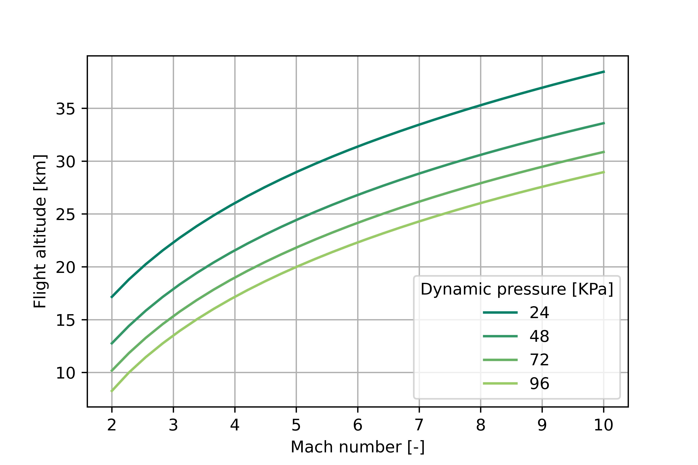

# Introduction
Flight vehicles - specifically propulsive systems in the supersonic regime - are typically designed to operate at a fixed dynamic pressure for a 
specified Mach number. Since the dynamic pressure is a function of local air properties
at a given flight altitude, as defined in the equation below, the flight altitude can be found knowing 
the operating dynamic pressure and Mach number.
$$P_{dyn} = (1/2)\rho_{\infty} v_{\infty}^2$$ 
Once the flight altitude is found, the other air properties relevant to the flight vehicle are 
readily calculated.

# Method
In order to determine the flight altitude as a function of the Mach number and dynamic pressure, the barometric
formula is solved: https://en.wikipedia.org/wiki/Barometric_formula. The Barometric formula relates altitude to the local properties of 
the atmosphere - the air density, pressure, and temperature. However, the nature of these
equations results in an implicit governing equation that is solved numerically using Python's
powerful SymPy package.

# Output
The Python scripts output a simple ASCII file listing the converged altitude solution and relevant air and flight properties at that altitude and Mach number, like 
shown below:

    For Mach 8 and dynamic pressure 48.0 KPa: 
    ------------------------------------------------------------------------------ 
    Flight altitude: 30.5938385599783 km 
    ------------------------------------------------------------------------------ 
       Air temperature: 227.243838559978 K 
       Air pressure: 1071.42857142858 Pa 
       Air density: 0.0164281708184875 kg/m**3 
       Airspeed: 2417.35821866300 m/s 
       Stagnation temperature: 3131.62791278342 K 

Additionally, a simple postprocessing script was written to show altitude results graphically for different Mach numbers and dynamic pressures:

